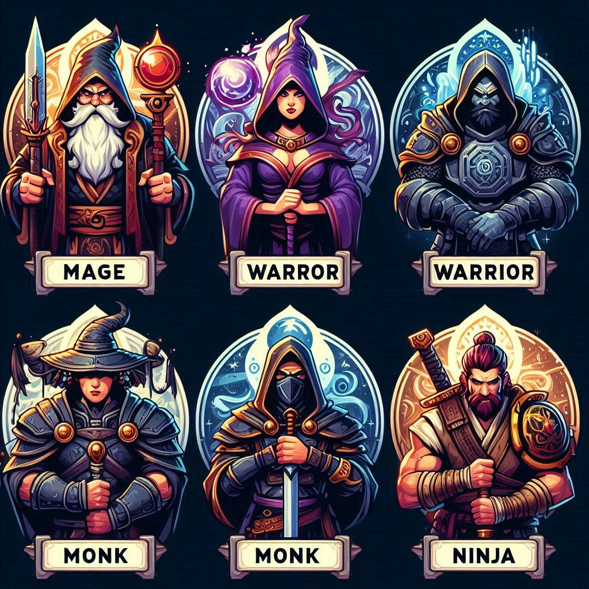

# 🦸‍♂️ Heróis de Aventura - DIO 🦸‍♀️

Seja bem-vindo ao mundo dos **Heróis de Aventura**! 🌟 Aqui você encontra **magos, guerreiros, monges e ninjas** prontos para viver grandes aventuras 🗡️⚡🥋🎯.

Este projeto foi desenvolvido como parte do desafio da [DIO](https://www.dio.me/), explorando conceitos fundamentais de JavaScript em um projeto épico! 🚀

---

## 🔍 **Sobre o Projeto**

Neste jogo, você vai:
- Criar heróis incríveis com **nome**, **idade** e **tipo**.
- Dar vida aos seus heróis com o método **atacar**, que exibe mensagens épicas como:
  - **Mago**: "O mago atacou usando **magia**."
  - **Guerreiro**: "O guerreiro atacou usando **espada**."
  - **Monge**: "O monge atacou usando **artes marciais**."
  - **Ninja**: "O ninja atacou usando **shuriken**."

E muito mais! 📜

## 🎨 Visual

### ⚡ Inspiração Épica


*Este é o visual inspirado no mundo dos heróis de aventura! 🦸‍♂️⚔️*

---

Pronto para explorar e criar os heróis mais incríveis do universo!

## 🛠️ **Tecnologias Utilizadas**

- 💻 JavaScript ES6
- 🧠 Lógica de programação
- 🎨 Criatividade e diversão!

---

## ✨ **Exemplo de Código**
```javascript
// Definição da classe Heroi
class Heroi {
  // O construtor é usado para inicializar as propriedades da classe
  constructor(nome, idade, tipo) {
    this.nome = nome; // Nome do herói
    this.idade = idade; // Idade do herói
    this.tipo = tipo; // Tipo do herói (ex: mago, guerreiro, monge, ninja)
  }

  // Método atacar, que exibe uma mensagem personalizada com base no tipo do herói
  atacar() {
    let ataque; // Variável para armazenar a descrição do ataque

    // Estrutura condicional para determinar o ataque com base no tipo do herói
    switch (this.tipo.toLowerCase()) { // Converte o tipo para letras minúsculas para evitar erros
      case "mago":
        ataque = "usou magia"; // Ataque para heróis do tipo "mago"
        break;
      case "guerreiro":
        ataque = "usou espada"; // Ataque para heróis do tipo "guerreiro"
        break;
      case "monge":
        ataque = "usou artes marciais"; // Ataque para heróis do tipo "monge"
        break;
      case "ninja":
        ataque = "usou shuriken"; // Ataque para heróis do tipo "ninja"
        break;
      default:
        ataque = "realizou um ataque indefinido"; // Caso o tipo seja desconhecido
    }

    // Exibe a mensagem personalizada no console
    console.log(`O ${this.tipo} atacou usando ${ataque}.`);
  }
}

// Exemplo de uso da classe Heroi:

// Criação de um herói do tipo "mago"
const heroi1 = new Heroi("Merlin", 30, "mago");
heroi1.atacar(); // Saída: O mago atacou usando magia.

// Criação de um herói do tipo "guerreiro"
const heroi2 = new Heroi("Aragorn", 35, "guerreiro");
heroi2.atacar(); // Saída: O guerreiro atacou usando espada.
```

#

## 📂 Estrutura do Repositório

* `index.js:` Código fonte do jogo.

* `src/assets/:` Imagens e recursos extras.

* `README.md:` Arquivo com todas as informações do projeto.
